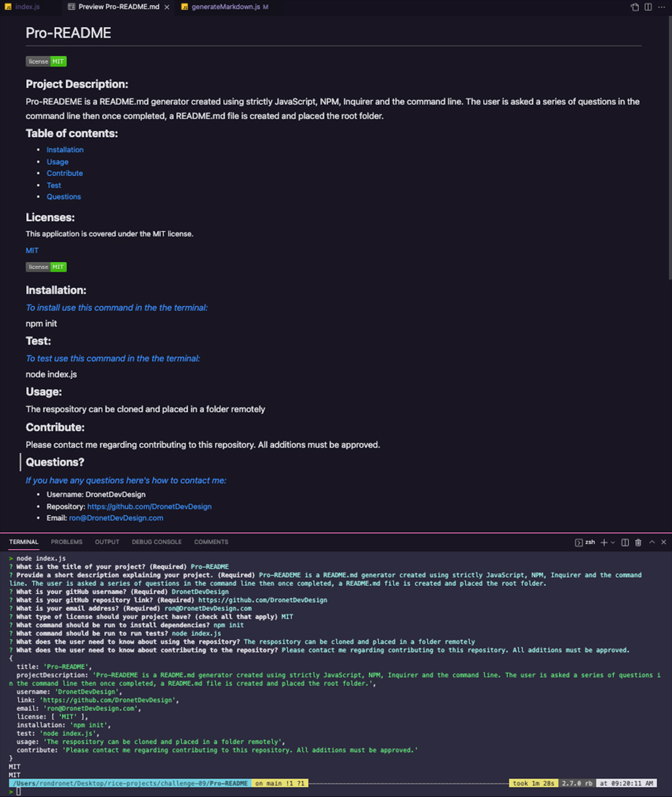

  # Pro-README

  ## **Project Description:**
  ### Pro-READEME is a README.md generator created using strictly JavaScript, NPM, Inquirer and the command line. The user is asked a series of questions in the command line then once completed a README.md file is created and placed in the root folder. Click the link below to watch the command line demo.

  ## **Video Demo Link:**

  ## **Table of contents:**
  * [Installation](#installation)
  * [Test](#test)
  * [Usage](#usage)
  * [Contribute](#contribute)
  * [Questions](#questions)

   
    

       
    

   

  ## **Installation:**
  ### *To install use this command in the the terminal:*
  ### npm init

  ## **Test:**
  ### *To test use this command in the the terminal:*
  ### node index.js

  ## **Usage:**
  ### The respository can be cloned and placed in a folder remotely

  ## **Contribute:**
  ### Please contact me regarding contributing to this repository. All additions must be approved.

  ## **Questions?**
  ### *If you have any questions here's how to contact me:*
  * Username: DronetDevDesign
  * Repository: https://github.com/DronetDevDesign
  * Email: ron@DronetDevDesign.com
